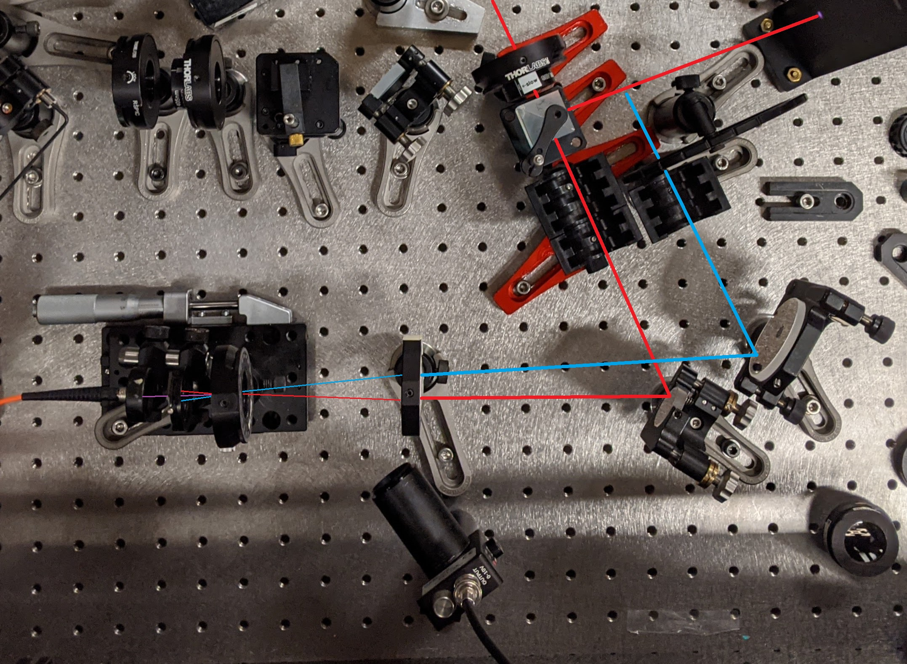
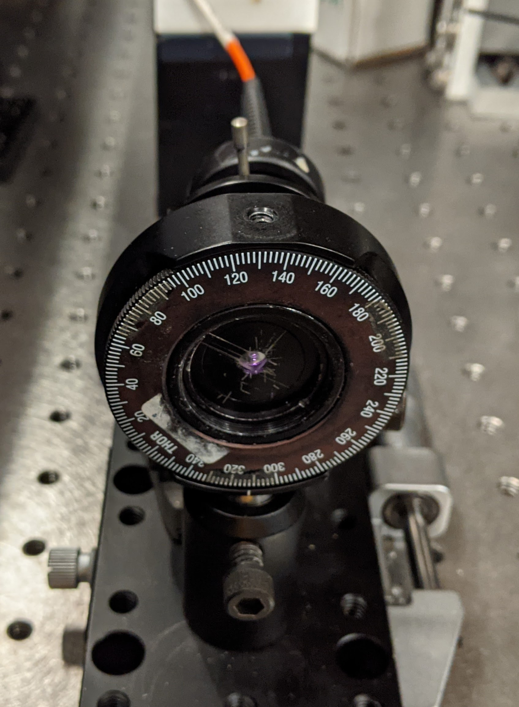
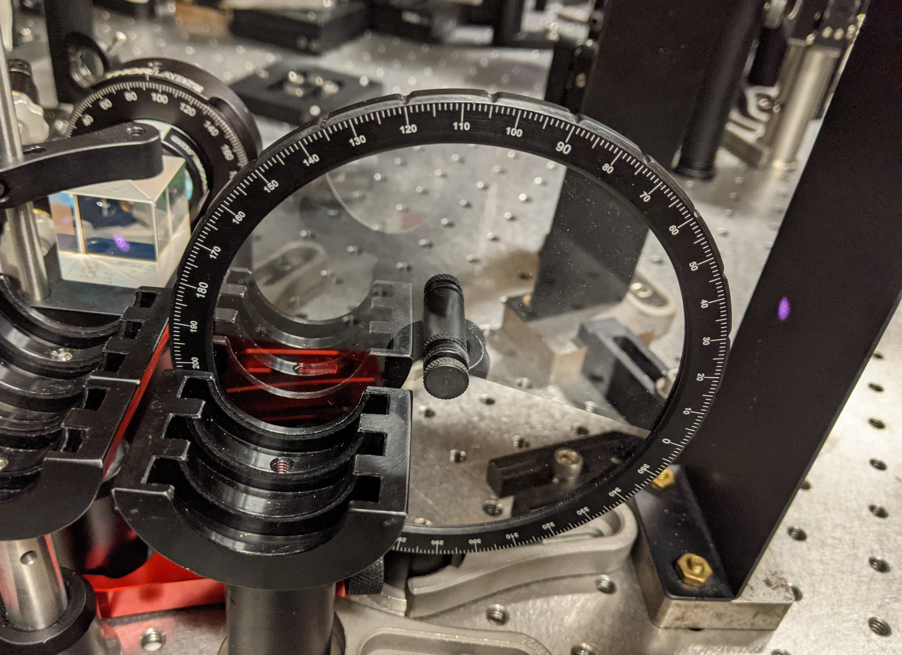

#### Cross-correlation on Pierced sCFG
Purpose: Quantify notch temporal profile

| Run # | info | start-position (step) end-position |
| :-: | - | - | - |
| 1 | control | 160 (1) 240 | . |
| 2 | 4-fiber notch | 178 (0.25) 190 | spectrum |
| 3 | control | 178 (0.25) 190 | . |

* red arm power before waveplate: 180 uJ
* probe power 0.42 mJ before NF filter

#### Images

